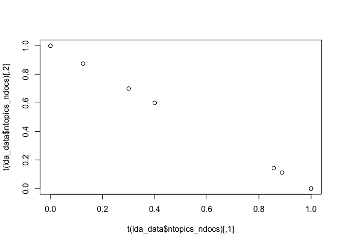

<!-- README.md is generated from README.Rmd. Please edit that file -->

<!-- badges: start -->

[](https://travis-ci.org/news-r/textanalysis)
[](https://www.tidyverse.org/lifecycle/#experimental)
<!-- badges: end -->

# textanalysis

Text Analysis in R via Julia.

## Installation

Being a wrapper to a [Julia](https://julialang.org/) package,
textanalysis requires the latter to be installed.

``` r
# install.packages("remotes")
remotes::install_github("news-r/textanalysis") # github
```

## Setup

You *must* run `init_textanalysis` at the begining of every session, you
will otherwise encounter errors and be prompted to do so.

``` r
textanalysis::init_textanalysis() # setup textanalysis Julia dependency
#> Julia version 1.1.1 at location /Applications/Julia-1.1.app/Contents/Resources/julia/bin will be used.
#> Loading setup script for JuliaCall...
#> Finish loading setup script for JuliaCall.
#> ✔ textanalysis initialised.
```

## Basic Examples

``` r
library(textanalysis)

# build document
str <- paste(
  "They <span>write</span>, it writes too!!!",
  "This is another sentence.",
  "More stuff in this document."
)
doc <- string_document(str)

# basic cleanup
prepare(doc)
#> ⚠ This function changes `document` in place!
get_text(doc)
#> [1] "  write     writes         sentence    stuff     document"

# stem
stem_words(doc)
get_text(doc)
#> [1] "write write sentenc stuff document"

# corpus
doc2 <- token_document("Hey write another document.")
get_text(doc2)
#> [1] "Hey write another document ."

# combine
corpus <- corpus(doc, doc2)

# standardize
standardize(corpus, "token_document")
#> ⚠ This function changes `corpus` in place!

# prepare corpus
prepare(corpus, strip_html_tags = FALSE)
#> ⚠ This function changes `cropus` in place!
get_text(corpus[[1]])
#> [1] "write write sentenc stuff document"

# lexicon + lexical stats
update_lexicon(corpus)
lexicon(corpus)
#> # A tibble: 6 x 2
#>   words        n
#>   <chr>    <int>
#> 1 stuff        1
#> 2 document     2
#> 3 write        3
#> 4 hey          1
#> 5 ""           2
#> 6 sentenc      1
lexical_frequency(corpus, "document")
#> [1] 0.2

# inverse index
update_inverse_index(corpus)
inverse_index(corpus)
#> [1] 6

# dtm
m <- document_term_matrix(corpus)

# term-frequency
tf(m)
#>      [,1] [,2] [,3] [,4] [,5] [,6]
#> [1,]  0.0  0.2  0.0  0.2  0.2  0.4
#> [2,]  0.4  0.2  0.2  0.0  0.0  0.2

# tf-idf
tf_idf(m)
#>           [,1] [,2]      [,3]      [,4]      [,5] [,6]
#> [1,] 0.0000000    0 0.0000000 0.1386294 0.1386294    0
#> [2,] 0.2772589    0 0.1386294 0.0000000 0.0000000    0

# sentiment
sentiment(corpus)
#> [1] 0.5834179 0.5475631

# summarise in 2 sentences
summarize(string_document(str), ns = 2L)
#> [1] "They <span>write</span>, it writes too!!!"
#> [2] "This is another sentence."
```

## Latent Dirichlet Allocation

fit LDA on the [gensimr](https://gensimr.news-r.org) data.

``` r
set.seed(42)

data("corpus", package = "gensimr")
documents <- to_documents(corpus) # convert vector to documents

crps <- corpus(documents)
update_lexicon(crps)
dtm <- document_term_matrix(crps)

# 50 topics
# 10K iterations
lda_data <- lda(dtm, 2L, 1000L)

# visualise topics
plot(t(lda_data$ntopics_ndocs))
```



``` r

mat <- dtm_matrix(dtm, "dense")

tfidf <- tf_idf(mat)

kmeans(tfidf, centers = 2)
#> K-means clustering with 2 clusters of sizes 1, 8
#> 
#> Cluster means:
#>         [,1]       [,2]       [,3]       [,4]       [,5]       [,6]
#> 1 0.37601935 0.00000000 0.37601935 0.00000000 0.00000000 0.00000000
#> 2 0.01880097 0.05483616 0.01880097 0.03433163 0.02746531 0.03051701
#>         [,7]       [,8]       [,9]      [,10]      [,11]      [,12]
#> 1 0.00000000 0.00000000 0.00000000 0.00000000 0.00000000 0.00000000
#> 2 0.03433163 0.06212391 0.02746531 0.03433163 0.04230218 0.03433163
#>        [,13]      [,14]      [,15]      [,16]      [,17]      [,18]
#> 1 0.00000000 0.00000000 0.00000000 0.00000000 0.00000000 0.00000000
#> 2 0.03923615 0.04230218 0.03433163 0.03051701 0.03433163 0.03923615
#>        [,19]      [,20]      [,21]      [,22]      [,23]      [,24]
#> 1 0.00000000 0.00000000 0.00000000 0.00000000 0.00000000 0.00000000
#> 2 0.03923615 0.03433163 0.03923615 0.05483616 0.03923615 0.03433163
#>        [,25]      [,26]      [,27]      [,28]      [,29]      [,30]
#> 1 0.00000000 0.00000000 0.00000000 0.37601935 0.00000000 0.00000000
#> 2 0.03433163 0.04577551 0.03051701 0.01880097 0.04165269 0.02746531
#>        [,31]      [,32]      [,33]      [,34]      [,35]      [,36]
#> 1 0.00000000 0.00000000 0.00000000 0.00000000 0.00000000 0.00000000
#> 2 0.02746531 0.03923615 0.03051701 0.02746531 0.03923615 0.03969093
#>        [,37]      [,38]      [,39]      [,40]      [,41]      [,42]
#> 1 0.37601935 0.00000000 0.00000000 0.00000000 0.00000000 0.00000000
#> 2 0.01880097 0.05378623 0.03433163 0.03969093 0.03051701 0.05296881
#>        [,43]      [,44]      [,45]
#> 1 0.00000000 0.00000000 0.00000000
#> 2 0.03923615 0.05187891 0.02746531
#> 
#> Clustering vector:
#> [1] 2 2 2 2 2 2 2 2 1
#> 
#> Within cluster sum of squares by cluster:
#> [1] 0.000000 2.548672
#>  (between_SS / total_SS =  16.6 %)
#> 
#> Available components:
#> 
#> [1] "cluster"      "centers"      "totss"        "withinss"    
#> [5] "tot.withinss" "betweenss"    "size"         "iter"        
#> [9] "ifault"
```
