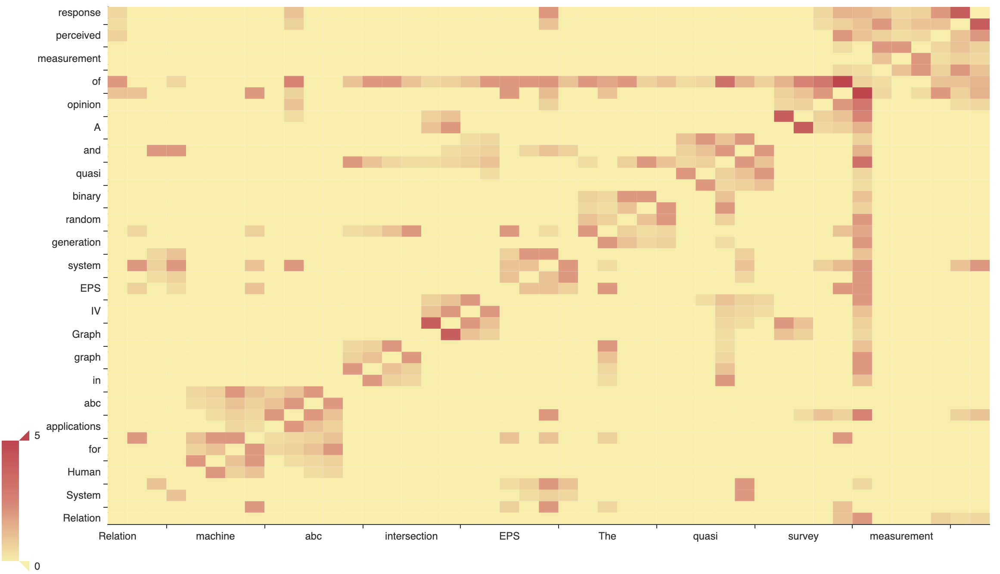

<!-- README.md is generated from README.Rmd. Please edit that file -->

<!-- badges: start -->

[](https://travis-ci.org/news-r/textanalysis)
[](https://www.tidyverse.org/lifecycle/#experimental)
<!-- badges: end -->

# textanalysis

Text Analysis in R via Julia.

## Installation

Being a wrapper to a [Julia](https://julialang.org/) package,
textanalysis requires the latter to be installed.

``` r
# install.packages("remotes")
remotes::install_github("news-r/textanalysis") # github
```

## Setup

You *must* run `init_textanalysis` at the begining of every session, you
will otherwise encounter errors and be prompted to do so.

``` r
library(textanalysis) # load the package

init_textanalysis() # initialise
#> Julia version 1.1.1 at location /Applications/Julia-1.1.app/Contents/Resources/julia/bin will be used.
#> Loading setup script for JuliaCall...
#> Finish loading setup script for JuliaCall.
#> ✔ textanalysis initialised.
```

Some funtions depend on the development version of the Julia package, to
install it run:

``` r
install_textanalysis(version = "latest")
```

## Basic Examples

``` r
# build document
str <- paste(
  "They <span>write</span>, it writes too!!!",
  "This is another sentence.",
  "More stuff in this document."
)
doc <- string_document(str)

# basic cleanup
prepare(doc)
#> ⚠ This function changes `document` in place!
get_text(doc)
#> [1] " write  writes     sentence  stuff   document"

# stem
stem_words(doc)
get_text(doc)
#> [1] "write write sentenc stuff document"

# corpus
doc2 <- token_document("Hey write another document.")

# combine
corpus <- corpus(doc, doc2)

# standardize
standardize(corpus, "token_document")
#> ⚠ This function changes `corpus` in place!

# prepare corpus
prepare(corpus, strip_html_tags = FALSE)
#> ⚠ This function changes `cropus` in place!
get_text(corpus)
#> # A tibble: 2 x 2
#>   text                               document
#>   <chr>                                 <int>
#> 1 write write sentenc stuff document        1
#> 2 "hey write  document "                    2

# lexicon + lexical stats
lexicon(corpus)
#> # A tibble: 6 x 2
#>   words        n
#>   <chr>    <int>
#> 1 stuff        1
#> 2 document     2
#> 3 write        3
#> 4 hey          1
#> 5 ""           2
#> 6 sentenc      1
lexical_frequency(corpus, "document")
#> [1] 0.2

# inverse index
inverse_index(corpus)
#> [1] 6

# dtm
m <- document_term_matrix(corpus)

# term-frequency
tf(m)
#>      [,1] [,2]
#> [1,]  0.0  0.4
#> [2,]  0.2  0.2
#> [3,]  0.0  0.2
#> [4,]  0.2  0.0
#> [5,]  0.2  0.0
#> [6,]  0.4  0.2

# tf-idf
tf_idf(m)
#>           [,1]      [,2]
#> [1,] 0.0000000 0.2772589
#> [2,] 0.0000000 0.0000000
#> [3,] 0.0000000 0.1386294
#> [4,] 0.1386294 0.0000000
#> [5,] 0.1386294 0.0000000
#> [6,] 0.0000000 0.0000000

# bm-25
# https://opensourceconnections.com/blog/2015/10/16/bm25-the-next-generation-of-lucene-relevation/
bm_25(m)
#>           [,1]      [,2]
#> [1,] 0.0000000 1.0748378
#> [2,] 0.8340518 0.8340518
#> [3,] 0.0000000 1.4779019
#> [4,] 1.4779019 0.0000000
#> [5,] 1.4779019 0.0000000
#> [6,] 0.7210474 0.5421369

# sentiment
sentiment(corpus)
#> [1] 0.5834179 0.5475631

# summarise in 2 sentences
summarize(string_document(str), ns = 2L)
#> [1] "They <span>write</span>, it writes too!!!"
#> [2] "This is another sentence."
```

## Latent Dirichlet Allocation

fit LDA on the [gensimr](https://gensimr.news-r.org) data.

``` r
set_seed(42L)
#> Julia Object of type MersenneTwister.
#> MersenneTwister(UInt32[0x0000002a], Random.DSFMT.DSFMT_state(Int32[964434469, 1073036706, 1860149520, 1073503458, 1687169063, 1073083486, -399267803, 1072983952, -909620556, 1072836235  …  -293054293, 1073002412, -1300127419, 1073642642, 1917177374, -666058738, -337596527, 1830741494, 382, 0]), [0.0, 0.0, 0.0, 0.0, 0.0, 0.0, 0.0, 0.0, 0.0, 0.0  …  0.0, 0.0, 0.0, 0.0, 0.0, 0.0, 0.0, 0.0, 0.0, 0.0], UInt128[0x00000000000000000000000000000000, 0x00000000000000000000000000000000, 0x00000000000000000000000000000000, 0x00000000000000000000000000000000, 0x00000000000000000000000000000000, 0x00000000000000000000000000000000, 0x00000000000000000000000000000000, 0x00000000000000000000000000000000, 0x00000000000000000000000000000000, 0x00000000000000000000000000000000  …  0x00000000000000000000000000000000, 0x00000000000000000000000000000000, 0x00000000000000000000000000000000, 0x00000000000000000000000000000000, 0x00000000000000000000000000000000, 0x00000000000000000000000000000000, 0x00000000000000000000000000000000, 0x00000000000000000000000000000000, 0x00000000000000000000000000000000, 0x00000000000000000000000000000000], 1002, 0)

data("corpus", package = "gensimr")
documents <- to_documents(corpus) # convert vector to documents

crps <- corpus(documents)
dtm <- document_term_matrix(crps)

# 2 topics
# 1K iterations
lda_data <- lda(dtm, 2L, 1000L)

# classification
lda_data$ntopics_ndocs
#>            [,1]      [,2]
#>  [1,] 1.0000000 0.0000000
#>  [2,] 0.1000000 0.9000000
#>  [3,] 0.6666667 0.3333333
#>  [4,] 1.0000000 0.0000000
#>  [5,] 0.0000000 1.0000000
#>  [6,] 0.0000000 1.0000000
#>  [7,] 0.0000000 1.0000000
#>  [8,] 0.0000000 1.0000000
#>  [9,] 0.0000000 1.0000000

mat <- dtm_matrix(dtm, "dense")

tfidf <- tf_idf(mat)

km <- kmeans(tfidf, centers = 2)
```

## Hash trick

``` r
hash_func <- create_hash_function(10L)
hash("a", hash_func)
#> [1] 8
hash(doc) # doc has built-in has
#>      [,1] [,2] [,3] [,4] [,5] [,6] [,7] [,8] [,9] [,10] [,11] [,12] [,13]
#> [1,]    0    0    0    0    0    0    0    0    0     0     0     0     0
#>      [,14] [,15] [,16] [,17] [,18] [,19] [,20] [,21] [,22] [,23] [,24]
#> [1,]     0     0     0     0     1     0     0     0     1     0     0
#>      [,25] [,26] [,27] [,28] [,29] [,30] [,31] [,32] [,33] [,34] [,35]
#> [1,]     0     0     0     0     0     0     1     0     0     0     0
#>      [,36] [,37] [,38] [,39] [,40] [,41] [,42] [,43] [,44] [,45] [,46]
#> [1,]     0     0     0     0     0     0     0     0     0     0     0
#>      [,47] [,48] [,49] [,50] [,51] [,52] [,53] [,54] [,55] [,56] [,57]
#> [1,]     0     0     0     0     2     0     0     0     0     0     0
#>      [,58] [,59] [,60] [,61] [,62] [,63] [,64] [,65] [,66] [,67] [,68]
#> [1,]     0     0     0     0     0     0     0     0     0     0     0
#>      [,69] [,70] [,71] [,72] [,73] [,74] [,75] [,76] [,77] [,78] [,79]
#> [1,]     0     0     0     0     0     0     0     0     0     0     0
#>      [,80] [,81] [,82] [,83] [,84] [,85] [,86] [,87] [,88] [,89] [,90]
#> [1,]     0     0     0     0     0     0     0     0     0     0     0
#>      [,91] [,92] [,93] [,94] [,95] [,96] [,97] [,98] [,99] [,100]
#> [1,]     0     0     0     0     0     0     0     0     0      0
```

## Naive Bayes Classifier

``` r
classes <- factor(c("financial", "legal"))
model <- init_naive_classifer(classes)

train <- tibble::tibble(
  text = c("this is financial doc", "this is legal doc"),
  labels = factor(c("financial", "legal"))
)

train_naive_classifier(model, train, text, labels)
#> ⚠ This function changes `model` in place!

test <- tibble::tibble(
  text = "this should be predicted as a legal document"
)
predict_class(model, test, text)
#> # A tibble: 1 x 2
#>   legal financial
#>   <dbl>     <dbl>
#> 1 0.667     0.333
```

## Co-occurence Matrix

Plot method uses [echarts4r](https://echarts4r.john-coene.com)

``` r
matrix <- coom(crps)
plot(matrix)
```


